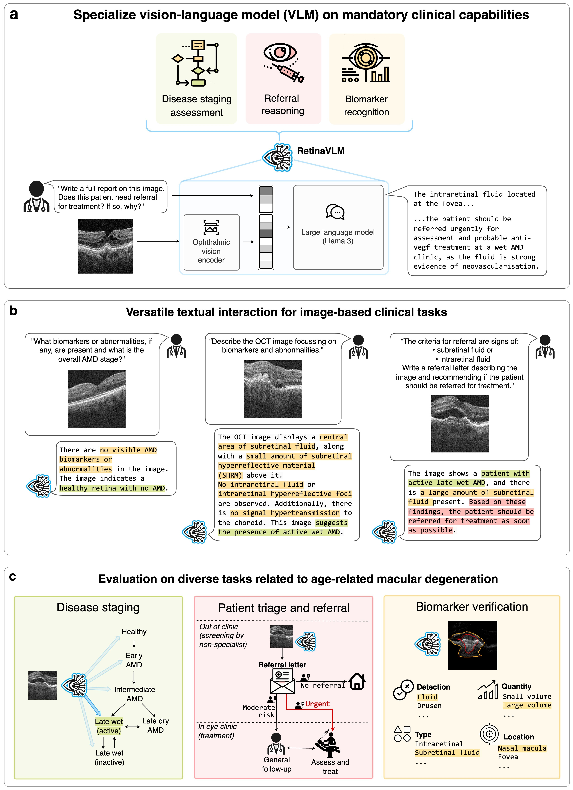

# SpecialistVLMs
Developing vision-language models (VLMs) towards expert-level performance in specific medical specialties.

Paper preprint [https://arxiv.org/abs/2407.08410](https://arxiv.org/abs/2407.08410)

Specialization blueprint:
1. **Connect with domain experts** in the target medical specialty or patient pathway
2. **Derive mandatory capabilities** for image-based clinical decision makers operating in that specialty
3. **Comprehensively annotate a set of representative images** with observations and recommended actions
4. **Generate visual question-answer (VQA) curriculum**, or otherwise use an independent large language model (LLM) to reformat annotations according to preference
5. **Specialize an existing VLM on your curriculum**, and evaluate its performance on mixture of closed- and open-ended tasks on a hold-out test set

Through the application of this blueprint, we trained a vision-language model (VLM) towards facilitating tasks related to the care of patients with age-related macular degeneration (AMD) from retinal OCT images.

## Creating training curricula for your specific domain (with demo)

**Demo** To create your own VQA curriculum:
1. Place your image annotations in `dataset/sample_annotations`
2. If using GPT-series LLMs, add your OpenAI API key to your custom `paths.openai_api_key` config
3. Run `run/demos/generate_curriculum.py paths=template paths.openai_api_key=<your_api_key> model/language_model=gpt-4o dataset/task=specialist_annotate dataset/task/curriculum=demo_curriculum` to create your sample VQA

In our paper we generated two curricula for specialization. To generate curriculum part 1:

`run/generate_curriculum_part1.py dataset=retina model/language_model=gpt-4o dataset/task=tabular_annotate dataset/task/curriculum=tabular_annotate_rules`

To generate the modules in curriculum part 2 we use `1_advanced_biomarkers_guidelines`, `2_specific_qa`... `10_staging_accuracy`:

`run/generate_curriculum_part2.py dataset=retina model/language_model=gpt-4o dataset/task=specialist_annotate dataset/task/curriculum=1_advanced_biomarkers_guidelines`

## Training a VLM on your specialist curricula

We then progressively specialize RetinaVLM on those curricula:

`run/vision_language_pretraining.py dataset=retina pretrained_models=new dataset/task=curriculum_part_1_introduction_to_retina`

`run/vision_language_pretraining.py dataset=retina pretrained_models=retinavlm_base_192px dataset/task=curriculum_part_2_advanced_retinal_specialism`

## Testing your VLM on closed-ended tasks

Evaluating RetinaVLM on closed-ended tasks `closed_ended_specialist_staging`, `closed_ended_specialist_referral` or `closed_ended_specialist_biomarkers`

`run/closed_ended_evaluation.py pretrained_models=specialist_v5_192px dataset=retina dataset/task=closed_ended_specialist_staging`

## Running the VLM for open-ended tasks (with demo)

**Disclaimer** The models provided on [HuggingFace](https://huggingface.co/RobbieHolland/RetinaVLM) were developed for research purposes, and are not intended or applicable for immediate clinical use. They are prototype models that were solely developed to evidence the potential of our needs-driven and expert-led blueprint for training medical VLMs. The performance reported in the paper was for Topcon OCT mediolateral 2D image slices with 7.0×23.4 μm pixel dimensions, extracted at the fovea.

**Demo** To run RetinaVLM:

1. Install the reduced set of packages listed in `run/demos/demo_requirements.txt`

2. Save images to `dataset/processed_images`

3. Request access to [Meta's Llama 3 model](https://huggingface.co/meta-llama/Meta-Llama-3-8B). Then, log into your HuggingFace account using `huggingface-cli login` by providing a READ token (generated in settings).

4. Run `run/demos/inference.py paths=template`, which will download and run the [HuggingFace](https://huggingface.co/RobbieHolland/RetinaVLM) model, and evaluate it on your images and custom textual queries and instructions

## Generating visual-language saliency maps

Code for computing visual saliency maps to passages in the RetinaVLM's generated reports

`run/visual_language_gradcam.py dataset=retina dataset/task=language_visual_attention pretrained_models=specialist_v5_192px`

#### Data availability

Both imaging datasets are currently being curated and maintained by the Vienna Reading Center on behalf of the PINNACLE consortium. The data will be made available once the PINNACLE study concludes in 2026.

#### Dependencies

A list of required packages can be installed using `requirements.txt`

This repository also makes references to [Microsoft LLaVA-Med](https://github.com/microsoft/LLaVA-Med) and [Med-Flamingo](https://github.com/snap-stanford/med-flamingo)
